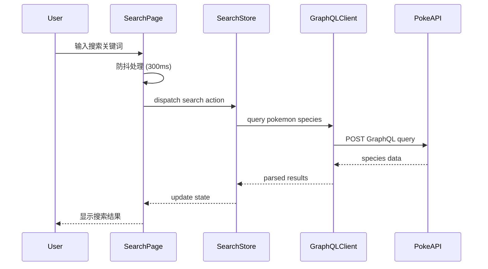
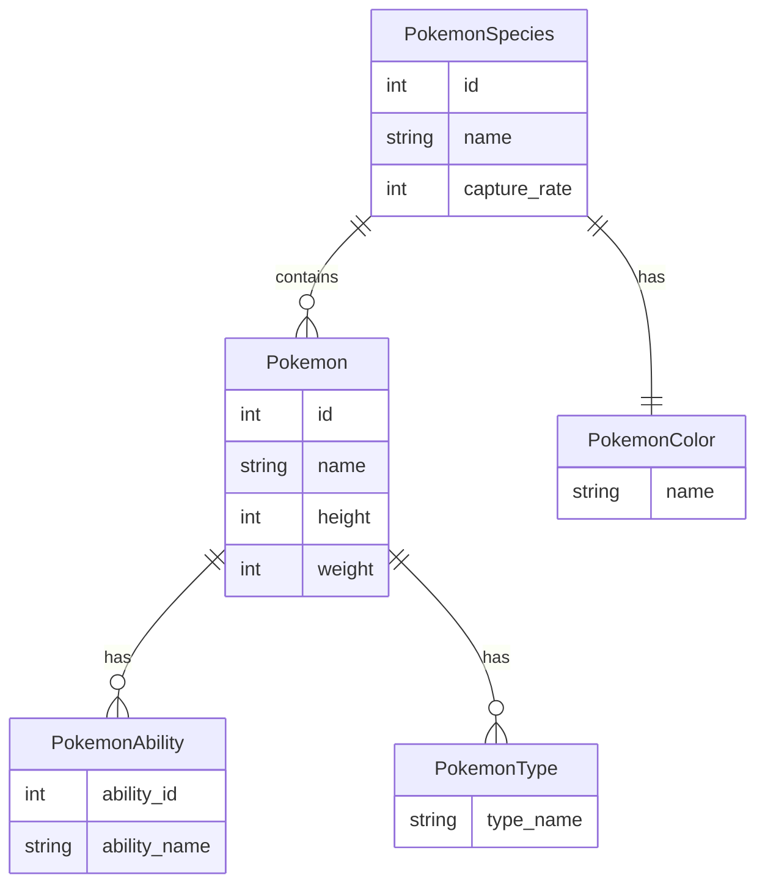

# 设计文档

## 概述

宝可梦微信小程序是一个基于Vue3的单页应用，通过GraphQL API与PokeAPI集成，为用户提供宝可梦物种搜索和详情查看功能。应用采用现代前端架构，使用Pinia进行状态管理，支持主题切换和响应式设计。

### 核心功能

1. **首次启动体验**: 欢迎模态框，提供友好的初始化体验
2. **主题系统**: 三种可切换的视觉主题，持久化用户偏好
3. **搜索功能**: 基于GraphQL的模糊搜索，支持防抖和自动搜索
4. **结果展示**: 分页显示搜索结果，包含物种信息和捕捉率
5. **详情页面**: 展示宝可梦的详细信息和技能列表
6. **状态管理**: 使用Pinia管理全局状态和页面导航状态

### 技术选型理由

- **Vue3 + Composition API**: 提供更好的类型推导和逻辑复用能力
- **Pinia**: 轻量级状态管理，与Vue3深度集成，提供TypeScript支持
- **GraphQL**: 精确获取所需数据，减少网络传输和过度获取
- **Less**: 提供变量、嵌套和混合功能，便于主题系统实现
- **Axios**: 成熟的HTTP客户端，支持拦截器和请求取消

## 架构

### 系统架构

应用采用三层架构：

```
┌─────────────────────────────────────────┐
│         Presentation Layer              │
│  (Vue Components + Less Styles)         │
│                                         │
│  ┌──────────┐  ┌──────────┐  ┌───────┐│
│  │ Search   │  │ Detail   │  │ Theme ││
│  │ Page     │  │ Page     │  │ Modal ││
│  └──────────┘  └──────────┘  └───────┘│
└─────────────────┬───────────────────────┘
                  │
┌─────────────────▼───────────────────────┐
│         State Management Layer          │
│            (Pinia Stores)               │
│                                         │
│  ┌──────────┐  ┌──────────┐  ┌───────┐│
│  │ Search   │  │ Theme    │  │ Welcome││
│  │ Store    │  │ Store    │  │ Store ││
│  └──────────┘  └──────────┘  └───────┘│
└─────────────────┬───────────────────────┘
                  │
┌─────────────────▼───────────────────────┐
│         Data Access Layer               │
│      (GraphQL Client + API)             │
│                                         │
│  ┌──────────────────────────────────┐  │
│  │   GraphQL Client (Axios)         │  │
│  │   - Query Builder                │  │
│  │   - Error Handler                │  │
│  │   - Response Parser              │  │
│  └──────────────────────────────────┘  │
└─────────────────┬───────────────────────┘
                  │
┌─────────────────▼───────────────────────┐
│         External Services               │
│                                         │
│  PokeAPI GraphQL Endpoint               │
│  https://beta.pokeapi.co/graphql/v1beta │
└─────────────────────────────────────────┘
```

### 数据流



### 组件层次结构

```
App.vue
├── WelcomeModal.vue (首次启动)
├── ThemeSelector.vue (主题切换)
└── Router View
    ├── SearchPage.vue
    │   ├── SearchInput.vue
    │   ├── SearchButton.vue
    │   ├── LoadingIndicator.vue
    │   ├── SearchResults.vue
    │   │   └── SpeciesCard.vue (多个)
    │   │       └── PokemonItem.vue (多个)
    │   └── Pagination.vue
    └── DetailPage.vue
        ├── PokemonHeader.vue
        ├── AbilitiesList.vue
        └── BackButton.vue
```

## 组件和接口

### 核心组件

#### 1. SearchPage.vue

**职责**: 搜索页面主容器，协调搜索输入、结果显示和分页

**Props**: 无

**Emits**: 无

**Composition API 组合**:
- `useSearchStore()`: 访问搜索状态和操作
- `useThemeStore()`: 访问当前主题
- `useDebouncedSearch()`: 防抖搜索逻辑

**关键方法**:
```typescript
interface SearchPageMethods {
  handleSearch(keyword: string): Promise<void>
  handlePageChange(page: number): void
  navigateToDetail(pokemonId: number): void
}
```

#### 2. DetailPage.vue

**职责**: 显示单个宝可梦的详细信息

**Props**:
```typescript
interface DetailPageProps {
  pokemonId: number
}
```

**Emits**:
```typescript
interface DetailPageEmits {
  back: () => void
}
```

**Composition API 组合**:
- `usePokemonDetail(pokemonId)`: 获取宝可梦详情数据
- `useThemeStore()`: 访问当前主题

#### 3. WelcomeModal.vue

**职责**: 首次启动欢迎界面

**Props**: 无

**Emits**:
```typescript
interface WelcomeModalEmits {
  close: () => void
}
```

**Composition API 组合**:
- `useWelcomeStore()`: 管理欢迎模态框状态

### Pinia Stores

#### SearchStore

```typescript
interface SearchState {
  keyword: string
  results: PokemonSpecies[]
  currentPage: number
  totalPages: number
  pageSize: number
  isLoading: boolean
  error: string | null
}

interface SearchActions {
  search(keyword: string): Promise<void>
  setPage(page: number): void
  clearResults(): void
}

interface SearchGetters {
  paginatedResults: () => PokemonSpecies[]
  hasResults: () => boolean
  isEmpty: () => boolean
}
```

#### ThemeStore

```typescript
interface ThemeState {
  currentTheme: 'pokemon' | 'dark' | 'light'
  availableThemes: Theme[]
}

interface ThemeActions {
  setTheme(themeName: string): void
  loadTheme(): void
  persistTheme(): void
}

interface Theme {
  name: string
  colors: {
    primary: string
    secondary: string
    background: string
    text: string
    accent: string
  }
}
```

#### WelcomeStore

```typescript
interface WelcomeState {
  hasShown: boolean
  shouldShow: boolean
}

interface WelcomeActions {
  markAsShown(): void
  checkFirstLaunch(): void
}
```

### GraphQL Client API

#### GraphQLClient 类

```typescript
class GraphQLClient {
  private baseURL: string
  private axiosInstance: AxiosInstance

  constructor(baseURL: string)
  
  async query<T>(
    query: string, 
    variables?: Record<string, any>
  ): Promise<T>
  
  async searchPokemonSpecies(
    keyword: string, 
    limit: number, 
    offset: number
  ): Promise<PokemonSpeciesResponse>
  
  async getPokemonDetail(
    pokemonId: number
  ): Promise<PokemonDetail>
}
```

#### GraphQL 查询定义

**搜索物种查询**:
```graphql
query SearchPokemonSpecies($keyword: String!, $limit: Int!, $offset: Int!) {
  pokemon_v2_pokemon(
    where: { name: { _ilike: $keyword } }
    limit: $limit
    offset: $offset
  ) {
    id
    name
    capture_rate
    pokemon_v2_pokemoncolor {
      name
    }
    pokemon_v2_pokemons {
      id
      name
      pokemon_v2_pokemonabilities {
        pokemon_v2_ability {
          name
        }
      }
    }
  }
}
```

**宝可梦详情查询**:
```graphql
query GetPokemonDetail($pokemonId: Int!) {
  pokemon_v2_pokemon_by_pk(id: $pokemonId) {
    id
    name
    height
    weight
    pokemon_v2_pokemonabilities {
      pokemon_v2_ability {
        id
        name
      }
    }
    pokemon_v2_pokemontypes {
      pokemon_v2_type {
        name
      }
    }
  }
}
```

### 工具函数和组合式函数

#### useDebouncedSearch

```typescript
interface UseDebouncedSearchOptions {
  delay?: number
  immediate?: boolean
}

function useDebouncedSearch(
  callback: (keyword: string) => void,
  options?: UseDebouncedSearchOptions
): {
  debouncedSearch: (keyword: string) => void
  cancel: () => void
  flush: () => void
}
```

#### useLocalStorage

```typescript
function useLocalStorage<T>(
  key: string,
  defaultValue: T
): {
  value: Ref<T>
  save: () => void
  load: () => void
  clear: () => void
}
```

## 数据模型

### PokemonSpecies (宝可梦物种)

```typescript
interface PokemonSpecies {
  id: number
  name: string
  capture_rate: number
  pokemon_v2_pokemoncolor: {
    name: string
  }
  pokemon_v2_pokemons: Pokemon[]
}
```

### Pokemon (宝可梦实例)

```typescript
interface Pokemon {
  id: number
  name: string
  height?: number
  weight?: number
  pokemon_v2_pokemonabilities: PokemonAbility[]
  pokemon_v2_pokemontypes?: PokemonType[]
}
```

### PokemonAbility (宝可梦技能)

```typescript
interface PokemonAbility {
  pokemon_v2_ability: {
    id: number
    name: string
  }
}
```

### PokemonType (宝可梦类型)

```typescript
interface PokemonType {
  pokemon_v2_type: {
    name: string
  }
}
```

### SearchResult (搜索结果)

```typescript
interface SearchResult {
  species: PokemonSpecies[]
  total: number
  page: number
  pageSize: number
}
```

### Theme (主题)

```typescript
interface Theme {
  name: string
  displayName: string
  colors: ThemeColors
}

interface ThemeColors {
  primary: string
  secondary: string
  background: string
  surface: string
  text: string
  textSecondary: string
  accent: string
  error: string
  success: string
  warning: string
}
```

### 数据关系图



